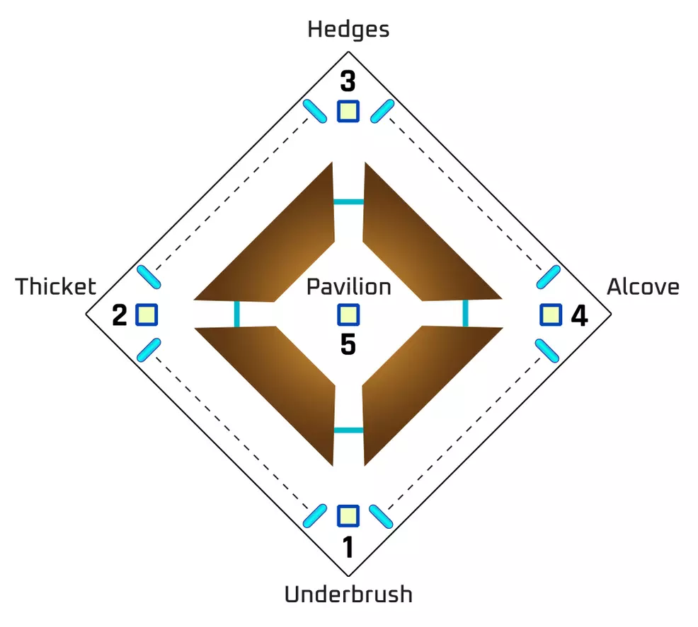
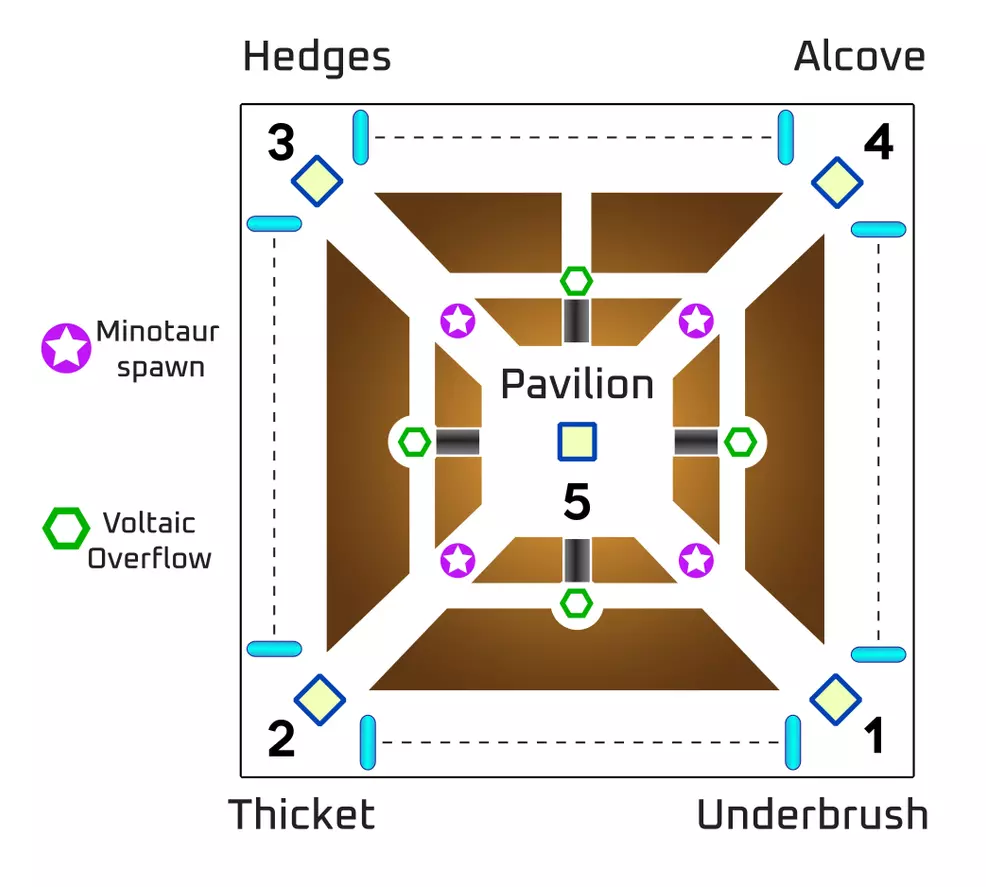
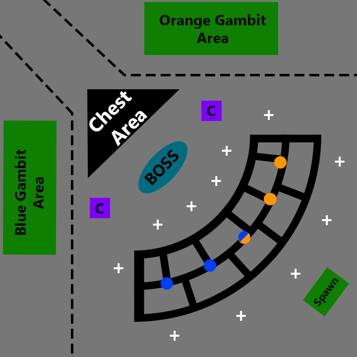

# Garden of Salvation

The Garden of Salvation entry point is located on the Moon map. The very beginning of the raid is accessible from patrol, but the raid itself is not.

## Encounter 1: Evade the Consecrated Mind – Embrace

The first encounter in the Garden of Salvation has players evade the Consecrated Mind. To do this, teams split into two in order to open doors and collect Voltaic Overflow. The end of the section is a mad dash through an open field.

Create a tether chain to the Vex barrier to start encounter.

One group pushes to next barrier, killing the **Angelic** and tethering the door open.

Other group stays near Consecrated Mind, collecting its Voltaic Overflow.

When Consecrated Mind moves, the back team leapfrogs over the forward team into the new area.

Continue leapfrogging, collecting Voltaic Overflow and tethering the Vex barrier open.
When in the open field, collect Voltaic Overflow and fight to the other side to end the encounter.

### Encounter Mechanics

**Voltaic Overflow** – The Consecrated Mind will create a Voltaic Overflow every 60 seconds or so. Unless picked up, it will explode and kill the team. A player who picks it up will receive a 2 minute 30 second timer. Collecting another one while this timer is still going will kill the player.

**Angelic** – A special type of Hydra that must be killed to unlock the box, allowing players to use it to tether open a door.

**Tethering** – Standing near an unlocked Vex box and shooting it creates a tether, which links between all nearby players. This is used to unlock the locks on the Vex barriers.

**Overload Minotaurs** – Giant Minotaurs that can only be dealt significant damage when disrupted using Overload Bullets.

### In-Depth Explanation

The Party should split into two Squads of 3. All members should be sure to have an **OVERLOAD** weapon (Machineguns and Bows), and be suited up for addclear.

Squad A pushes forward and attacks the first Vex Gate, Killing the **Angelic** Hydra and **OVERLOAD** Minotaur.

Meanwhile, Squad B deals with all adds, and obtains Voltaic Overflows from the boss.

Once Squad A has unlocked the gate, Squad B rushes ahead to the second gate, and kills  the **Angelic** and the **OVERLOAD**, while Squad A kills adds and obtains the Overflow.
Alternate like this until the final gate is reached, where there will be **THREE** of each **OVERLOAD** and **ANGELIC**.

After the Final Gate is opened, it is a mad focused dash to the end. Only one player needs to reach the end, but EVERYONE needs to kill the several **OVERLOAD** Minotaurs and the Cyclops, while still collecting the Voltaic Overflow.

## Encounter 2: Summon the Consecrated Mind - Undergrowth

The second encounter in the Garden of Salvation tasks players with summoning the Consecrated Mind. This is accomplished by securing four relays at the four corners of the area and holding them until the center Vex barriers unlock.

Kill the Goblins in the center to start the encounter.

Two players defend the first relay while four players rotate clockwise to the next relay.

Four players clear Relay 2 and leave one player there to defend it. The rest push on.

Three players clear Relay 3 and leave one player there to defend it. The rest push on.

Two players clear Relay 4 and leave one player there to defend it
One player from Relay 1 and the last player float between each relay, helping clear enemies and refreshing the **Enlightened** buff.

Each relay will be assaulted by three **Angelics**. Once all 12 are defeated, the center Vex barrier will drop.

All players fight to the center and defend Relay 5 until the encounter ends.

### Encounter Mechanics

**Barrier Hobgoblins** – Giant Hobgoblins that generate a shield to heal themselves that can only be broken with Anti-Barrier Rounds.

**Relays** – Must be defended from Vex and charged using Vex box and tether. There are five in the map, one in each corner and one in the very center for the final wave of enemies. Provides an Enlightened buff when tethered. Once activated, the portals at the back will activate allowing for quick access to each corner.

**Tether** – Each area has a Vex box that must be used to create a tether to the relay, refreshing it if any Vex have uploaded. It also provides the **Enlightened** buff.

**Enlightened** – A 44 second buff that allows players to break the white shields of enemies.

**Angelics** – Hydras that must be killed to unlock the Vex boxes. These assault the relays in groups of three once all four relays are active.

### Tips

There will be **BARRIER** Hobgoblins here. Bring scouts and auto rifles to break the barriers.

Be sure to make use of any mod that can force heavy ammo drops.

Be careful of AOEs from the **Angelics**, and dont let any vex near your conduits.

### Map

## Encounter 3: Defeat the Consecrated Mind – Undergrowth

The third encounter in the Garden of Salvation raid tasks players with defeating the Consecrated Mind. This takes place in the inner area of the Undergrowth and involves depositing motes and shooting the Consecrated Mind’s eyes.

Create a tether from the Vex box to the center relay to start the encounter.

Three players locate the bank and start killing minotaurs and collecting motes. Player that collects motes deposits them and uses the **Enlightened** buff to pop the white shields.

Other three players follow the Consecrated Mind. One player collects the Voltaic Overflow and calls out which eyes are red, the inside or outside.

Switch player roles if all three players have Voltaic Overflow counters.

When 30 motes are collected, everyone follows the boss to the bank and the damage phase begins.

Shoot all of the red eyes to stun the boss, opening its weak point. Shoot the center of the boss as it retreats. Repeat the steps until the boss is defeated.

### Encounter Mechanics

**Motes** – Minotaurs will spawn down the lanes and drop motes when killed. Collect motes and deposit them in the relays. Bank 30 motes to activate a damage phase. After collecting a mote, the player will receive a 60 second counter, if the counter reaches zero before the motes are banked, the player will lose all the motes. Players can hold a max or 10 motes at a time.

**Relays** – Every round, one of the four relays in the corners will become the bank. This will be shown by it glowing brightly. Thirty motes must be banked to activate a damage phase."

**Enlightened** – Whenever a player banks motes, they will receive the **Enlightened** buff. They must then defend the relay from white-shield enemies.

**Voltaic Overflow** – The boss will fire out a Voltaic Overflow that must be collected or it wipes the team. A player who picks it up will receive a 2 minute 30 second timer. Collecting another one while this timer is still going will kill the player. The player that picks up the Voltaic will be locked in place and will need to provide information on the eye mechanic.

**Boss Eyes** – When a player collects the Voltaic Overflow, they will become trapped. The boss will spread out its fins, shining its eyes. The player that got the charge will need to call out which eyes are red: in or out.

Assisting players will need to shoot the correct eye to free the player that’s trapped. If the three correct eyes are not destroyed, the trapped player will die.

### Tips

There are no champions in this encounter, so move freely and fight how you prefer.

The player who gets captured is responsible for callouts. If the eyes aren't shot corretly, they will die, losing the party valuable time.

### Map

## Encounter 4: Defeat the Sanctified Mind

The last encounter in the Garden of Salvation is against the Sanctified Mind. The goal of this encounter is to create a tether from the relay to the boss. To do this, 30 motes must be deposited in each relay.

Begin the encounter by shooting the boss, defeat the enemies, kill the **Angelic**.

Destroy the boss' shoulder or knee, or both, and send player(s) through to collect motes. When they’ve collected 10, destroy the shoulder/knee to bring them back. Repeat until 30 motes are in each relay.
Defeat the enemies that spawn, including the **Angelic**.

Boss will show a blue or orange plus sign. Use the appropriate relay to create a tether to the plus sign. Once it is broken, immediately make a tether to the boss using the opposite relay.

Deal damage to Sanctified Mind and repeat the above steps

### Map

#### Map key:

- Crosses are the link points to get the platforms back
- Purple C's are the locations of where the cyclops spawn
